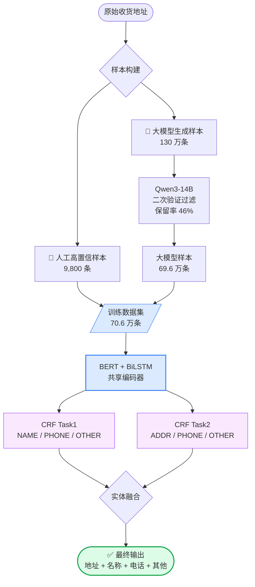
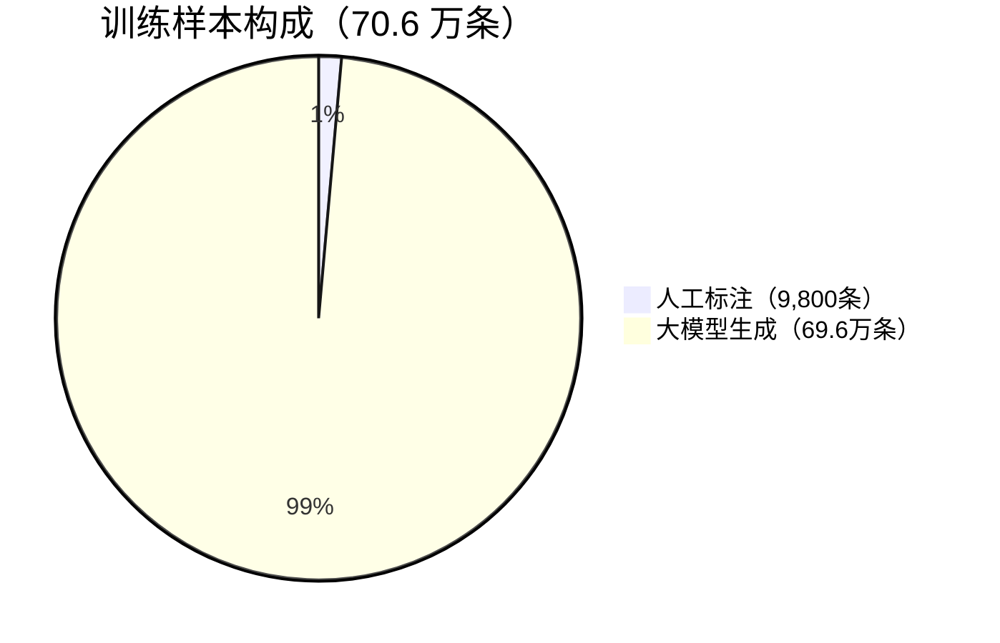
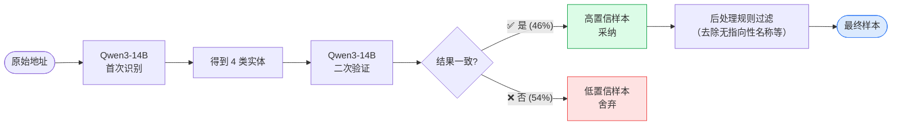
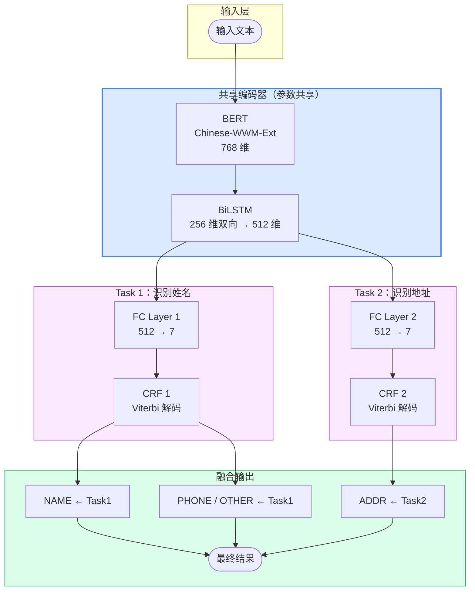
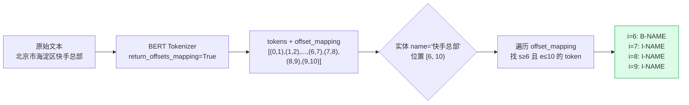
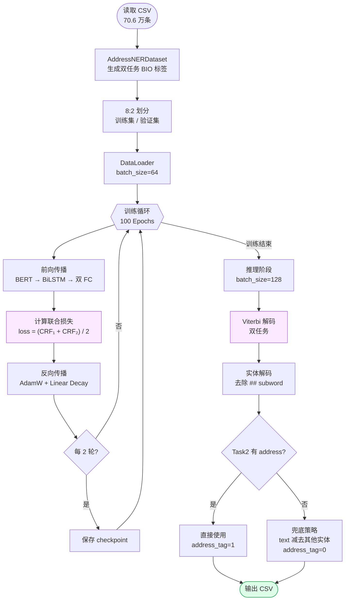
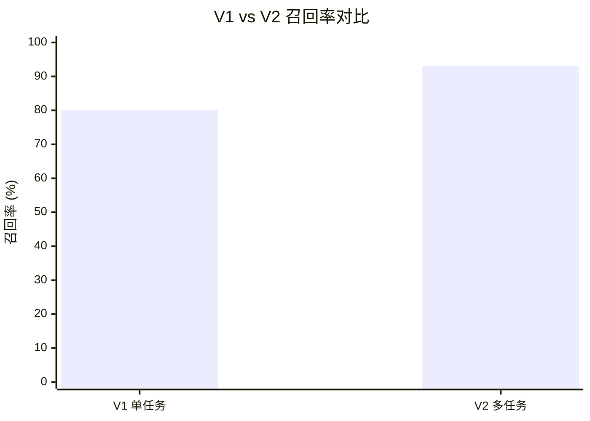
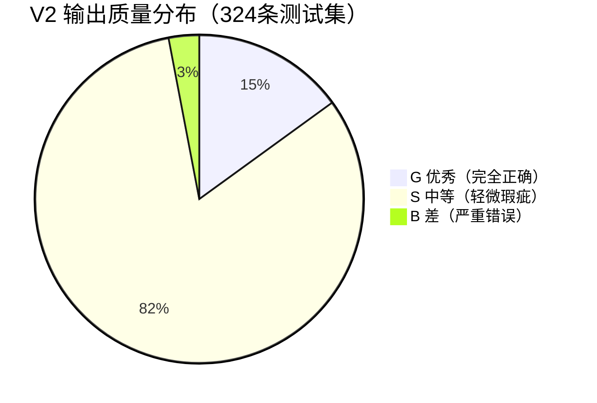
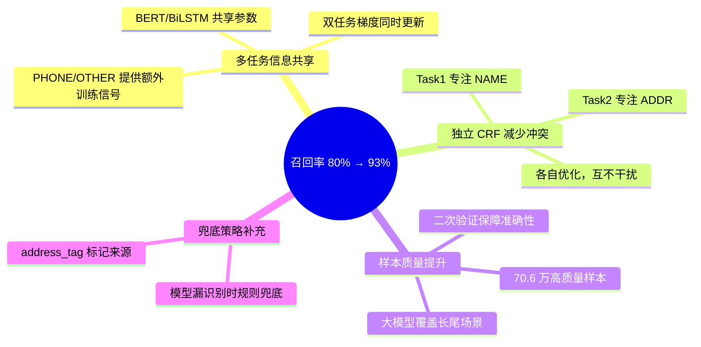

# 收货地址解析 POI 识别：BERT+BiLSTM+CRF 多任务学习实践

> 作者：王禹(wangyu17) · 时间：2026年3月 · 项目：POI-DP-Adaptor

---

## 一、背景与问题定义

### 业务背景

电商物流场景中，用户填写的收货地址格式混乱、信息杂糅：

```
北京市海淀区上地西路5号楼1单元205张三收13812345678
河南省驻马店市西平县专探乡老官陈天猫优选服务站
山西省太原市杏花岭区民营区五龙口街165号山西博瑞中西医结合医院
```

核心任务是从这些非结构化文本中识别 4 类实体：

| 实体类型 | 说明 | 示例 |
|---------|------|------|
| ADDRESS | 省市区街道等地理位置 | 北京市海淀区上地西路 |
| NAME | POI 名称（小区/商铺/医院） | 老官陈天猫优选服务站 |
| PHONE | 联系电话 | 13812345678 |
| OTHER | 收货人姓名、备注等 | 张三 |

### 核心挑战

**挑战 1：地址与名称粒度不统一**

不同类型地址对"名称"的定义截然不同：

```
# 商业类 —— 名称应独立提取
输入：河南省驻马店市西平县专探乡老官陈天猫优选服务站
✅ address="河南省驻马店市西平县专探乡"  name="老官陈天猫优选服务站"
❌ address="...老官陈天猫优选服务站"     name="陈天猫优选服务站"（前缀丢失）

# 住宅类 —— 楼栋单元归入地址，名称为空
输入：北京市海淀区上地西路5号楼1单元205张三
✅ address="北京市海淀区上地西路5号楼1单元"  name=""
❌ address="北京市海淀区上地西路"            name="5号楼1单元"（无指向性）
```

**挑战 2：实体边界模糊**
- 地址乱序：`5单元2号楼` 实际应为 `2号楼5单元`
- 名称截断：`瑞中西医结合医院` 应为 `山西博瑞中西医结合医院`
- 人名误识别为 POI 名称

**挑战 3：长尾样本多样性**
- 地址格式千变万化，缺少高质量标注样本
- 需处理百万级数据

### 量化目标

| 指标 | 目标 | V1 现状 |
|------|------|---------|
| 准确率 | ≥ 92% | 92% |
| 召回率 | ≥ 90% | 80% ❌ |
| GSB 分布 | G:S:B = 15%:80%:5% | — |

---

## 二、整体架构



---

## 三、样本构建与数据工程

### 3.1 样本来源



| 来源 | 数量 | 质量保障 |
|------|------|---------|
| 人工标注 | 9,800 条 | 100% 准确，用于对标 |
| 大模型生成（商业类） | 30 万条 | 二次验证过滤 |
| 大模型生成（普通类） | 130 万条 → 69.6 万条 | 二次验证，保留率 46% |

### 3.2 Qwen3-14B 数据生成

#### Prompt 设计

约 1000 字的 Prompt 模板，核心要点：

```python
PROMPT_TEMPLATE = """## Role: 运单地址实体识别工具
## 先验知识
1. 实体类型定义：
   (1) address：省市区乡镇街道等地理位置
   (2) name：有指向性的 POI 名称（商铺/医院/小区）
   (3) phone：联系电话
   (4) other：收货人姓名、备注等

2. 判断规则（9条）：
   - 名称地址对应原则：名称需与地址有明确对应关系
   - 指向性原则：纯楼栋单元号不作为名称
   - 完整性原则：名称不能截断...

## 输出格式
{"address": "...", "name": "...", "phone": "...", "other": "..."}
/no_think
"""
```

#### vLLM 批量推理

```python
llm = LLM(model=MODEL_PATH, tensor_parallel_size=4)  # 4 卡并行
sampling_params = SamplingParams(
    temperature=0.0,   # 确定性输出，保证可复现
    max_tokens=256,
)

# batch_size=32 批量处理
for i in range(0, len(prompts), 32):
    batch = prompts[i:i + 32]
    results = llm.generate(batch, sampling_params)
```

### 3.3 质量控制：二次验证



**后处理规则示例：**

```python
# 舍弃以楼栋单元开头的名称（无指向性）
bad_prefixes = ['x号楼', 'x幢', 'x楼', 'x座', 'x栋', 'x单元']

# 舍弃纯数字和符号的名称
if re.match(r'^[\d\-\.\s]+$', name):
    name = ""
```

过滤掉 820 条（1.2%），说明大模型生成质量较高。

---

## 四、模型设计：V1 vs V2

### 4.1 V1 的局限

V1 是单任务 BERT+CRF，标签体系：

```
O, B-ADDR, I-ADDR, B-NAME, I-NAME, B-PHONE, I-PHONE, B-OTHER, I-OTHER
```

单一 CRF 层需要同时学习 address 和 name 的边界，两类地址的需求相互冲突，导致：
- 商业地址名称前缀丢失
- 住宅地址楼栋被错误提取为名称
- 召回率仅 80%

### 4.2 V2 核心创新：双任务解耦

**关键洞察**：商业地址和住宅地址对"名称"的定义不同，单一模型无法兼顾。

**解决方案**：将任务拆分为两个互补的子任务：



**标签体系：**

```python
# Task1：专注识别姓名（不识别地址）
TAGS_TASK1 = ["O", "B-NAME", "I-NAME", "B-PHONE", "I-PHONE", "B-OTHER", "I-OTHER"]

# Task2：专注识别地址（不识别姓名）
TAGS_TASK2 = ["O", "B-ADDR", "I-ADDR", "B-PHONE", "I-PHONE", "B-OTHER", "I-OTHER"]
```

### 4.3 模型实现

```python
class MultiTaskBERTBiLSTMCRF(nn.Module):
    def __init__(self, model_name, num_labels_task1, num_labels_task2, hidden_dim=256):
        super().__init__()
        # 共享编码器
        self.bert = BertModel.from_pretrained(model_name)
        self.lstm = nn.LSTM(
            self.bert.config.hidden_size,  # 768
            hidden_dim,                    # 256
            batch_first=True,
            bidirectional=True             # 输出 512 维
        )
        # Task1 独立解码层
        self.fc_task1  = nn.Linear(hidden_dim * 2, num_labels_task1)
        self.crf_task1 = CRF(num_labels_task1, batch_first=True)
        # Task2 独立解码层
        self.fc_task2  = nn.Linear(hidden_dim * 2, num_labels_task2)
        self.crf_task2 = CRF(num_labels_task2, batch_first=True)

    def forward(self, input_ids, attention_mask, labels_task1=None, labels_task2=None):
        seq_output = self.bert(input_ids=input_ids, attention_mask=attention_mask).last_hidden_state
        seq_output, _ = self.lstm(seq_output)

        emissions1 = self.fc_task1(seq_output)
        emissions2 = self.fc_task2(seq_output)

        loss = None
        if labels_task1 is not None and labels_task2 is not None:
            mask = attention_mask.bool()
            loss1 = -self.crf_task1(emissions1, labels_task1, mask=mask, reduction="mean")
            loss2 = -self.crf_task2(emissions2, labels_task2, mask=mask, reduction="mean")
            loss = (loss1 + loss2) / 2   # 联合损失，简单平均

        return loss, emissions1, emissions2

    def decode(self, input_ids, attention_mask):
        seq_output = self.bert(input_ids=input_ids, attention_mask=attention_mask).last_hidden_state
        seq_output, _ = self.lstm(seq_output)
        mask = attention_mask.bool()
        preds1 = self.crf_task1.decode(self.fc_task1(seq_output), mask=mask)
        preds2 = self.crf_task2.decode(self.fc_task2(seq_output), mask=mask)
        return preds1, preds2
```

### 4.4 V1 vs V2 对比

| 维度 | V1（单任务） | V2（多任务） |
|------|------------|------------|
| 架构 | BERT + CRF | BERT + BiLSTM + 双 CRF |
| 任务数 | 1 | 2 |
| 标签数 | 9 | 2 × 7 |
| 准确率 | 92% | 92%（持平） |
| 召回率 | 80% ❌ | **93% ✅** |
| GSB 分布 | — | G:S:B = 15%:82%:3% |

---

## 五、数据集：双任务标签自动对齐

### 5.1 核心算法：offset_mapping 对齐

BERT 的 WordPiece 分词会拆分字符，需要将实体文本精确映射到 token 位置。



**完整实现：**

```python
def assign_labels(entity_dict, labels):
    for label_type, value in entity_dict.items():
        if not value:
            continue
        start_idx = text.find(value)
        if start_idx == -1:
            continue
        end_idx = start_idx + len(value)
        is_first = True

        for i, (s, e) in enumerate(offset_mapping):
            if s >= end_idx:
                break                    # 提前终止，性能优化
            if e <= start_idx:
                continue
            if s >= start_idx and e <= end_idx:
                if is_first:
                    labels[i] = f"B-{label_type}"
                    is_first = False
                else:
                    labels[i] = f"I-{label_type}"
```

### 5.2 标签生成示例

**输入：**
```
text    = "北京市海淀区上地西路5号楼1单元205张三13812345678"
address = "北京市海淀区上地西路5号楼1单元"
phone   = "13812345678"
other   = "张三"
```

**Task1 标签（识别姓名，不识别地址）：**

```
tokens:  [CLS] 北 京 市 海 淀 区 上 地 西 路 5 号 楼 1 单 元 205 张  三  138... [SEP]
labels:   O    O  O  O  O  O  O  O  O  O  O  O  O  O  O  O  O  O   B-O I-O B-P ...
```

**Task2 标签（识别地址，不识别姓名）：**

```
tokens:  [CLS] 北    京    市  ...  1    单   元   205  张   三   138... [SEP]
labels:   O    B-A  I-A  I-A  ...  I-A  I-A  I-A   O   B-O  I-O  B-P  ...
```

---

## 六、训练与推理

### 6.1 训练配置

```python
MODEL_NAME = "chinese-bert-wwm-ext"
MAX_LEN    = 128
BATCH_SIZE = 64
EPOCHS     = 100
LR         = 3e-5

optimizer  = AdamW(model.parameters(), lr=LR)
scheduler  = get_linear_schedule_with_warmup(
    optimizer,
    num_warmup_steps=0,
    num_training_steps=len(train_loader) * EPOCHS
)
```

### 6.2 训练流程



### 6.3 地址兜底策略

当 Task2 未识别出 address 时，用规则补充：

```python
def apply_address_fallback(text, name, phone, other):
    """从后往前删除 name/phone/other，剩余部分作为 address"""
    temp = text
    for ent in [name, phone, other]:
        if ent and ent in temp:
            # 从后往前删除最后一次出现，避免误删前面重复内容
            temp = temp[::-1].replace(ent[::-1], "", 1)[::-1]
    return temp
```

**示例：**
```
text  = "北京市海淀区上地西路5号楼1单元205张三13812345678"
phone = "13812345678"  →  删除后：...张三
other = "张三"         →  删除后：北京市海淀区上地西路5号楼1单元205
→ address = "北京市海淀区上地西路5号楼1单元205"
```

---

## 七、效果评估

### 7.1 V1 vs V2 指标对比



| 版本 | 准确率 | 召回率 | GSB 分布 |
|------|--------|--------|---------|
| V1 | 92% | 80% ❌ | — |
| V2 | 92% ✅ | **93% ✅** | G:S:B = 15%:82%:3% |
| 提升 | 持平 | **+13%** 🚀 | — |

> 评估样本：324 条人工标注测试集

### 7.2 典型案例对比

**案例 1：商业地址 — 名称完整性**

| | 地址 | 名称 |
|--|------|------|
| 输入 | `河南省驻马店市西平县专探乡老官陈天猫优选服务站` | |
| V1 ❌ | 河南省...老官陈天猫优选服务站 | 陈天猫优选服务站（前缀丢失） |
| V2 ✅ | 河南省驻马店市西平县专探乡 | **老官陈天猫优选服务站** |

**案例 2：医院地址 — 名称截断修复**

| | 地址 | 名称 |
|--|------|------|
| 输入 | `山西省太原市杏花岭区民营区五龙口街165号山西博瑞中西医结合医院` | |
| V1 ❌ | 山西省...山西博瑞中西医结合医院 | 瑞中西医结合医院（严重截断） |
| V2 ✅ | 山西省太原市杏花岭区民营区五龙口街165号 | **山西博瑞中西医结合医院** |

**案例 3：住宅地址 — 楼栋归入地址**

| | 地址 | 名称 |
|--|------|------|
| 输入 | `河北省石家庄市裕华区裕华路街道槐底街道滨河小区` | |
| V1 ⚠️ | 河北省...槐底街道 | 滨河小区（无指向性） |
| V2 ✅ | **河北省...槐底街道滨河小区** | （空，正确） |

### 7.3 质量分布



### 7.4 召回率提升原因分析



### 7.5 剩余错误模式

| 错误类型 | 示例 | 原因 |
|---------|------|------|
| 地址乱序 | `5单元2号楼` 未纠正为 `2号楼5单元` | 模型只做识别，不做规范化 |
| 人名误识别 | `李明` 被识别为 NAME | 姓名与 POI 名称边界模糊 |
| 地名/POI 混淆 | `五道口华清嘉园` 中 `五道口` 归属不明 | 需要地理知识 |

---

## 八、总结与展望

### 技术亮点

1. **多任务解耦**：双任务设计解决地址粒度不统一问题，召回率 +13%
2. **大模型数据工程**：Qwen3-14B + 二次验证，低成本构建 70.6 万高质量样本
3. **offset_mapping 精确对齐**：自动生成双任务 BIO 标签，处理 BERT subword 分词
4. **兜底策略**：规则补充模型漏识别，address_tag 标记来源便于分析

### 未来方向

| 方向 | 预期收益 |
|------|---------|
| 更大预训练模型（RoBERTa/ELECTRA） | 准确率 +1~2% |
| 知识图谱融合（高德/百度 POI 库） | 减少误识别 |
| 地址后处理规则（乱序纠正、规范化） | 修复剩余错误 |
| 主动学习 + 在线 retrain | 持续迭代提升 |
| 多模态融合（经纬度、门牌图像） | 复杂场景提升 |

### 一点反思

> 问题定义比技术选型更重要。V2 的成功不在于模型有多复杂，而在于准确识别了"地址粒度不统一"这个核心矛盾，然后用多任务学习这个简单优雅的方案解决了它。

---

## 参考资料

1. BERT: Pre-training of Deep Bidirectional Transformers — Devlin et al., 2019
2. Conditional Random Fields — Lafferty et al., 2001
3. An Overview of Multi-Task Learning in Deep Neural Networks — Sebastian Ruder, 2017
4. [Chinese-BERT-WWM-Ext](https://github.com/ymcui/Chinese-BERT-wwm) — 哈工大讯飞联合实验室
5. [vLLM](https://github.com/vllm-project/vllm) — Easy, Fast, and Cheap LLM Serving
6. Qwen Technical Report — Alibaba Cloud, 2023
